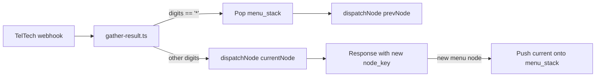

## Defaults I'm assuming (you skipped the questions)

- **Back model: dynamic stack** (matches your wording "previous menu where you came from"). The stack lives in `call_sessions.state_data.menu_stack` and is pushed/popped per call. Empty stack = stay on main menu.
- **Scope: menu-style nodes only** (`main_menu`, `catalog_action`, `catalog_after_add`, `cart_menu`, `orders_detail`, etc.). `#`-terminated input screens (catalog ID, card number, ZIP) keep their current behavior — too risky to repurpose `*` there.

If you want a different model, tell me and I'll adjust before coding.

---

## Architecture



The stack is mutated in two places only: **pop on `*`** before dispatch, **push when the response transitions to a new menu/input node**.

---

## 1. Universal `*` back handler

File: [apps/api/src/modules/teltech/handlers/gather-result.ts](apps/api/src/modules/teltech/handlers/gather-result.ts)

At the top of `handleGatherResult`, before dispatching:

- Read `digits = req.body.digits`.
- If `digits === '*'`:
  - Load `session.state_data.menu_stack` (default `[]`).
  - If non-empty: `prev = stack.pop()`, persist updated stack, clear `req.body.digits`, call `dispatchNode(req, res, prev, callSid, flowVersionId, { ...session, node_key: prev })`. Return.
  - If empty: re-dispatch current node with no digits (so caller hears prompt again) — or optionally play `"You're already at the main menu."` then re-prompt.

After the normal dispatch completes (existing `captured` interception at lines 84–89), inspect `captured.actions` for the `gather`/`collect` action's `action_url`. Extract its `node_key`. If it differs from `nodeKey` (the node the caller was just on) **and** the original `nodeKey` is a menu/input node, push `nodeKey` onto the stack and persist. Skip pushes when we just popped (track with a local `didPop` flag) and dedupe consecutive identical entries. Cap stack at 10.

Helper additions in [apps/api/src/modules/ivr/runtime.ts](apps/api/src/modules/ivr/runtime.ts):

- `pushMenuStack(callSid, nodeKey)` / `popMenuStack(callSid)` — read-modify-write on `call_sessions.state_data.menu_stack`.

## 2. Make `*` (and all menu keys) take immediate effect

Today single-digit menu nodes don't set `num_digits`, so TelTech default-terminates on `#`. Fix by adding `num_digits: 1` to every single-digit menu node's config.

New Supabase migration (applied via the Supabase MCP per `.cursor/rules/supabase-migrations.mdc`): update `ivr_nodes.config` for:

- `main_menu` — add `"num_digits": 1`
- `catalog_action` — add `"num_digits": 1`
- `catalog_after_add` — add `"num_digits": 1`
- `cart_menu` — add `"num_digits": 1`

`buildGather` already maps that into TelTech `min_digits=1, max_digits=1, terminator=''` (see [apps/api/src/modules/teltech/teltech-builder.ts](apps/api/src/modules/teltech/teltech-builder.ts) lines 38–52).

## 3. Remove now-redundant hardcoded `*` wiring

Same migration, plus code edits:

- Drop the `{"name":"main_menu","dtmf_key":"*",…}` intent entry from the `intents` array on `catalog_action`, `catalog_after_add`, and `cart_menu` (they're superseded by the universal handler, and they incorrectly always jump to `main_menu`).
- Update those nodes' `prompt_text`: replace `"Press star for Main Menu."` with `"Press star to go back."` (or drop entirely since the post-PIN announcement teaches `*`).
- In [apps/api/src/modules/ivr/handlers/orders-handlers.ts](apps/api/src/modules/ivr/handlers/orders-handlers.ts) lines 103–110: remove the explicit `digits === '*'` block — universal handler covers it. The `0` shortcut at lines 113–117 can stay or be removed; since `*` now means "back to orders list" (same as `0`), I'd remove `0` and update the prompt to `"Press star to return to your orders."`.

## 4. Post-PIN announcement

File: [apps/api/src/modules/ivr/handlers/pin-handlers.ts](apps/api/src/modules/ivr/handlers/pin-handlers.ts) success branch at lines 91–96.

Change:

```96:96:apps/api/src/modules/ivr/handlers/pin-handlers.ts
        response: buildGatherFromNode(nextNode, { call_sid: ctx.callSid, user_id: userId }),
```

to use the `overrides.prompt` argument of `buildGatherFromNode` (already supported at [teltech-builder.ts:100](apps/api/src/modules/teltech/teltech-builder.ts)) to prepend the announcement:

```ts
const intro = 'Please note, you can press star at any time to return to the previous menu. ';
response: buildGatherFromNode(
  nextNode,
  { call_sid: ctx.callSid, user_id: userId },
  { prompt: intro + (nextNode.prompt_text || '') }
),
```

Mirror the same change in [apps/api/src/modules/ivr/handlers/registration-handlers.ts](apps/api/src/modules/ivr/handlers/registration-handlers.ts) at the `confirm_pin_register` success path (around lines 173–184) so newly-registered callers also hear the announcement before their first main menu.

The announcement plays once per call (only on the first arrival at `main_menu`, immediately after PIN/registration). Subsequent visits to `main_menu` use the standard prompt with no preamble.

## 5. Stack-push edge cases worth calling out

- Re-prompts (caller times out or mis-keys and gets the same node again): same node, no push.
- Pure `say` + `redirect` chains (e.g. action nodes that flow into a menu): the response's terminal `gather` is what matters — push the menu node that was the *origin* of the chain (the `nodeKey` of this request), not intermediate redirects.
- Handlers that internally jump (e.g. `catalog_action` adding to cart and redirecting to `catalog_after_add`): the push logic compares query-string `node_key` of the response to `nodeKey` of the request, so this works automatically.

## Out of scope (per assumed Q2 default)

- Allowing `*` to cancel from `#`-terminated digit-entry screens (catalog ID, card number, ZIP, voice recordings). If you want that too, say so and I'll add a "if digits === '*'" short-circuit at the start of those handlers and the `input` node case in `graph-dispatcher.ts`.