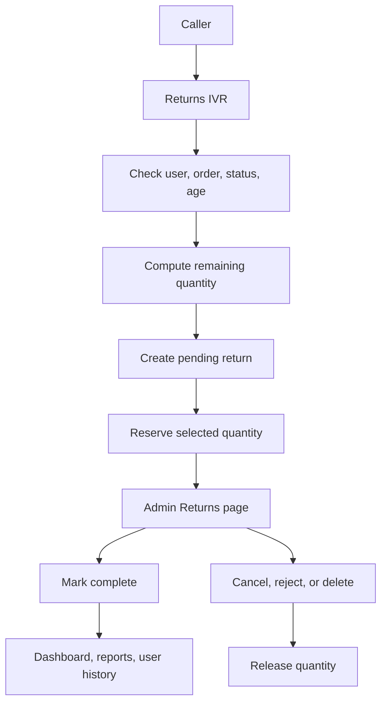

# Order Returns Implementation Plan

## Confirmed Decisions
- Returnable order statuses: `pending`, `processing`, `awaiting_confirmation`, `confirmed`, `completed`.
- Return window: 30 days from `orders.created_at`.
- Order entry stays 5 digits without `#` for now.
- Users can create multiple returns for one order, but only for remaining unreserved quantity.
- Pending returns reserve quantity immediately. `cancelled`, `rejected`, and `deleted` returns do not count in calculations and release quantity.
- Refunds are manual outside the system, with admin-editable fields for refunded tax, Amazon refund amount, and extra fees.
- Initial Amazon refund amount: `sum(order_item.amazon_price_cents * returned_qty)`.
- Initial tax refund amount: proportional to returned item subtotal, e.g. `round(order.tax_cents * returned_item_subtotal / order.subtotal_cents)`; shipping is not refunded.
- Dashboard/profit/report adjustments apply only when a return is marked `complete`, and should reflect later admin edits.

## Data Model And Migration
Create a Supabase MCP migration, per [`/home/simcha/Projects/voicex/.cursor/rules/supabase-migrations.mdc`](/home/simcha/Projects/voicex/.cursor/rules/supabase-migrations.mdc), not `db push`.

Add a returns ledger:
- `order_returns`: sequential BIGINT return ID, `order_id`, `user_id`, status (`pending`, `processing`, `complete`, `cancelled`, `rejected`, `deleted`), timestamps, manual refund fields, calculated item/tax/Amazon/fee totals, notes.
- `order_return_items`: line-level returned quantities linked to `order_items.id`, with snapshotted product/name/VoiceX ID/unit price/Amazon price for stable reporting.
- `order_return_fees`: admin-entered fee name + amount, included in profit/income calculations.

Add indexes for admin list, user history, report aggregation, and remaining-quantity checks. Extend `admin_alerts` so user-scoped alerts can exist without a `product_id`, or add a separate user-alert table if that is cleaner after implementation review.

## Return Flow
Use this flow for remaining quantity and status behavior:

## IVR Implementation
Add return nodes and prompts to the active IVR flow using a migration, then add handler code:
- New handler file: [`/home/simcha/Projects/voicex/apps/api/src/modules/ivr/handlers/returns-handlers.ts`](/home/simcha/Projects/voicex/apps/api/src/modules/ivr/handlers/returns-handlers.ts).
- Register it in [`/home/simcha/Projects/voicex/apps/api/src/modules/ivr/init-handlers.ts`](/home/simcha/Projects/voicex/apps/api/src/modules/ivr/init-handlers.ts).
- Update main menu option 4 from placeholder to `returns_menu`.
- Use fixed `num_digits: 5`, `finish_on_key: ""` for order ID entry.
- Use `#`-terminated VoiceX ID entry and custom short-timeout product list behavior for Return Node 14.
- All IVR lookups must verify `orders.user_id = session user_id`, allowed order status, 30-day age, and remaining returnable quantity.
- Branch prompts based on remaining returnable items, not original order quantities.

## Admin API
Add a full-admin returns router mounted from [`/home/simcha/Projects/voicex/apps/api/src/modules/admin/routes.ts`](/home/simcha/Projects/voicex/apps/api/src/modules/admin/routes.ts), following patterns in [`/home/simcha/Projects/voicex/apps/api/src/modules/admin/fulfillment.ts`](/home/simcha/Projects/voicex/apps/api/src/modules/admin/fulfillment.ts) and [`/home/simcha/Projects/voicex/apps/api/src/modules/admin/orders.ts`](/home/simcha/Projects/voicex/apps/api/src/modules/admin/orders.ts).

Endpoints to add:
- `GET /returns`: paginated sortable list with status/date filters.
- `GET /returns/pending-count`: sidebar badge count for `pending` only.
- `GET /returns/:id`: return detail with order, customer, items, fees, and refund fields.
- `PATCH /returns/:id`: update status, refunded tax, Amazon refund, fees, and notes.
- `GET /users/:id/returns`: popup history for the Users page.
- Returned-items report endpoints under [`/home/simcha/Projects/voicex/apps/api/src/modules/admin/reports.ts`](/home/simcha/Projects/voicex/apps/api/src/modules/admin/reports.ts).

Create/update high-return-user alerts when a user crosses more than 5 non-voided returns.

## Admin UI
Add admin return management:
- New page: `ReturnsPage` under [`/home/simcha/Projects/voicex/apps/admin-web/src/pages`](/home/simcha/Projects/voicex/apps/admin-web/src/pages).
- Route in [`/home/simcha/Projects/voicex/apps/admin-web/src/App.tsx`](/home/simcha/Projects/voicex/apps/admin-web/src/App.tsx).
- Sidebar link and pending badge in [`/home/simcha/Projects/voicex/apps/admin-web/src/components/Layout.tsx`](/home/simcha/Projects/voicex/apps/admin-web/src/components/Layout.tsx), mirroring Fulfillment/Alerts count behavior.
- Add order detail return links in [`/home/simcha/Projects/voicex/apps/admin-web/src/pages/OrderDetailPage.tsx`](/home/simcha/Projects/voicex/apps/admin-web/src/pages/OrderDetailPage.tsx).
- Add sortable `Returns` count, row highlighting, and history popup in [`/home/simcha/Projects/voicex/apps/admin-web/src/pages/UsersPage.tsx`](/home/simcha/Projects/voicex/apps/admin-web/src/pages/UsersPage.tsx).
- Extend [`/home/simcha/Projects/voicex/apps/admin-web/src/pages/AlertsPage.tsx`](/home/simcha/Projects/voicex/apps/admin-web/src/pages/AlertsPage.tsx) for High Returning User alerts.
- Add Returned Items report UI to [`/home/simcha/Projects/voicex/apps/admin-web/src/pages/ReportsPage.tsx`](/home/simcha/Projects/voicex/apps/admin-web/src/pages/ReportsPage.tsx).

## Financial Reporting
Update the dashboard RPC currently defined by migrations like [`/home/simcha/Projects/voicex/supabase/migrations/20260517215450_admin_dashboard_order_stats.sql`](/home/simcha/Projects/voicex/supabase/migrations/20260517215450_admin_dashboard_order_stats.sql):
- Sales should subtract completed return item subtotal and completed refunded tax.
- Profit should subtract completed returned VoiceX margin, then use admin-edited Amazon refund and fee fields where applicable.
- Voided returns (`cancelled`, `rejected`, `deleted`) do not affect stats, reports, or user return counts.

## Verification
After implementation:
- Verify schema via Supabase MCP `execute_sql` and keep the local migration timestamp aligned with the MCP migration.
- Test IVR scenarios: invalid order, wrong user, too old, no recent orders, full return, partial return, repeat partial return, fully returned product blocked, and `*` navigation.
- Test admin workflows: status changes, manual tax/Amazon/fee edits, delete/cancel releasing quantity, pending badge refresh, user highlighting, high-return alert creation, and returned-items report history.
- Run the repo’s typecheck/lint/test commands if available, and check lints on edited files.