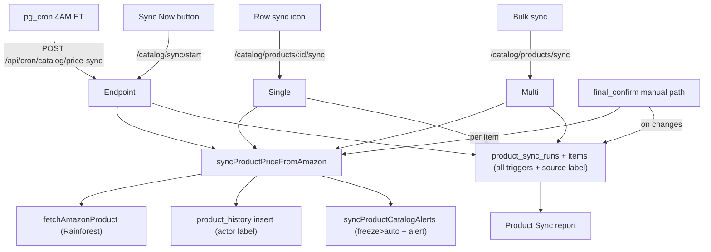

# Rainforest Auto Price Sync

Add a Rainforest-backed Amazon price sync system across settings, products, reports, and the checkout flow. All Amazon data fetching reuses the existing `fetchAmazonProduct(asin)` in [apps/api/src/lib/rainforest.ts](apps/api/src/lib/rainforest.ts). Freeze/alert behavior reuses `syncProductCatalogAlerts` in [apps/api/src/lib/product-price-alerts.ts](apps/api/src/lib/product-price-alerts.ts).

## Key decisions (confirmed)
- Checkout revalidation applies to the **manual** fulfillment path only, gated behind a new toggle setting.
- Unavailable items at checkout are auto-removed; caller is told and given the updated total.
- Freeze decision reuses existing logic (effective VoiceX price > local), via `syncProductCatalogAlerts`.
- History records the specific admin (name/email) for admin changes; `System` for sync/cron; `Checkout` for checkout revalidation.
- Sync-Now progress is tracked **in-memory** on the API server (polled by the frontend; pause is an in-memory flag).

## Core shared logic: `syncProductPriceFromAmazon(productId, actor)`
New helper in a new file `apps/api/src/lib/product-sync.ts`. Reused by single/bulk/full/cron/checkout flows.
- Loads product, calls `fetchAmazonProduct(amazon_asin)`.
- Compares `price_cents` vs stored `amazon_price_cents`; if changed, updates `amazon_price_cents`. Custom price auto-bumps automatically when `custom_price_cents IS NULL` (price is derived at read time via `getProductPriceCents`) - no extra write needed.
- Writes a `product_history` row for any price change (old/new) and for any status change (captured before/after calling alerts sync).
- Calls `syncProductCatalogAlerts(productId)` so frozen>auto + alert behavior stays identical to today.
- Returns `{ changed, oldAmazonCents, newAmazonCents, availability, oldStatus, newStatus }` so callers can append a `product_sync_run_items` row when running inside a sync run.
- `actor` is `{ kind: 'admin'|'system'|'checkout', adminUserId?, label }` used for both `product_history` attribution and the run's source label.
- A small `createSyncRun(trigger, actor, context?)` / `finalizeSyncRun(runId, ...)` helper wraps `product_sync_runs` creation so every entry point (single, bulk, full, auto, checkout) records a run with consistent source attribution.

## Data model (Supabase migrations, via Supabase MCP per workspace rule)
1. `product_history` table: `id`, `product_id` (FK), `change_type` (`price`|`status`), `old_value`, `new_value` (text), `actor_kind` (`admin`|`system`|`checkout`), `actor_label` (name/email or 'System'/'Checkout'), `actor_admin_user_id` (nullable), `created_at`. Index on `(product_id, created_at desc)`.
2. `product_sync_runs` + `product_sync_run_items` tables for the report history. Run has `id`, `started_at`, `finished_at`, `trigger` (`auto`|`manual_full`|`manual_single`|`manual_bulk`|`checkout`), `status`, counts. Source attribution mirrors `product_history`: `actor_kind` (`admin`|`system`|`checkout`), `actor_label` (admin name/email, `System`, or `Checkout`), `actor_admin_user_id` (nullable). Checkout-context columns (nullable, only set when `trigger = 'checkout'`): `order_id` (FK, nullable - set if/when an order is created), `user_id` (FK, nullable), `caller_phone`. Each item row has `run_id`, `product_id`, `old_amazon_price_cents`, `new_amazon_price_cents`, `direction` (`up`|`down`), plus `became_unavailable` (bool) so checkout availability removals show in the report. All sync types (auto, manual full, manual single, manual bulk, checkout) write a run; `product_history` is still written per change regardless.
3. Seed two `settings` rows: `rainforest_auto_sync_enabled` (`'false'`), `rainforest_sync_interval_hours` (`'24'`), and `rainforest_checkout_revalidation_enabled` (`'false'`).

## Settings (toggle + interval + checkout toggle)
- Add keys to `SETTING_KEYS` in [packages/shared/src/types/settings.ts](packages/shared/src/types/settings.ts).
- Backend validation in `normalizeSettingValue` ([apps/api/src/modules/admin/settings.ts](apps/api/src/modules/admin/settings.ts)): booleans accept only `'true'`/`'false'`; interval whitelisted to `1,3,10,24,48`.
- Frontend [apps/admin-web/src/pages/SettingsPage.tsx](apps/admin-web/src/pages/SettingsPage.tsx): render `rainforest_auto_sync_enabled` as toggle; when on, show interval `<select>` (1/3/10/24/48 hours). Render checkout-revalidation toggle. Add `Sync Now` / `Pause Sync` buttons + status bar near these settings (polls `GET /api/admin/catalog/sync/status`).

## Scheduled auto-sync (4AM EST)
- New `POST /api/cron/catalog/price-sync` in [apps/api/src/modules/cron/routes.ts](apps/api/src/modules/cron/routes.ts) (reuses `requireCronSecret`).
- Handler: if `rainforest_auto_sync_enabled` is off, no-op. Otherwise gate by interval: only run if `now - last_full_sync >= interval_hours` (track `last_full_sync_at` in a settings row or the latest `product_sync_runs.started_at`).
- Select **active** products only (`.eq('status','active')`), skip any whose `updated_at` is within the last 12 hours (manual/checkout/auto edits) to save credits.
- Process sequentially with a small delay (spacing over minutes; respects Rainforest 429s). Create one `product_sync_runs` row + per-change items.
- New pg_cron migration mirroring [supabase/migrations/20260615161749_subscriptions_cron.sql](supabase/migrations/20260615161749_subscriptions_cron.sql): schedule at `0 8,9 * * *` UTC (4AM ET across DST) calling the new endpoint via `run_subscription_cron`-style function.

## Manual full sync + progress + pause (in-memory)
- In-memory singleton `syncJobState` in `product-sync.ts`: `{ status: 'idle'|'running'|'paused', total, processed, currentProductId, startedAt, runId }` + `pauseRequested` flag.
- `POST /api/admin/catalog/sync/start` (full): kicks off async loop over active products (same 12h-skip + spacing as cron), writes a `product_sync_runs` row, updates in-memory progress per product, checks `pauseRequested` between products (finishes current, then stops). Loop continues even if the admin navigates away (server-side async).
- `POST /api/admin/catalog/sync/pause`, `GET /api/admin/catalog/sync/status`.
- Frontend status bar on SettingsPage polls status; shows progress + Pause button while running.

## Products page: per-row + bulk sync + history
[apps/admin-web/src/pages/ProductsPage.tsx](apps/admin-web/src/pages/ProductsPage.tsx) action column (`~1646`):
- Add a **sync icon** (e.g. `RefreshCw`) on every row regardless of status → `POST /api/admin/catalog/products/:id/sync` (single). Single sync writes a `product_sync_runs` row with `trigger = 'manual_single'` and `actor_kind = 'admin'` (admin name/email), plus `product_history`, then refreshes the row.
- Add a **history icon** (e.g. `History`) → opens a modal listing `product_history` rows for that product (timestamp, change type, old→new, actor) from `GET /api/admin/catalog/products/:id/history`.
- Bulk sync: add a `sync` action to the bulk actions array (mirrors existing `bulkDeleteActions` + [BulkActionBar](apps/admin-web/src/components/admin-table/BulkActionBar.tsx)) → `POST /api/admin/catalog/products/sync` with `{ ids }`. Bulk writes one `product_sync_runs` row with `trigger = 'manual_bulk'` and `actor_kind = 'admin'`, plus `product_history` per change.

## History logging integration
- Wrap status changes already happening in [apps/api/src/modules/admin/catalog.ts](apps/api/src/modules/admin/catalog.ts) PATCH (`~653`) and the auto-freeze/unfreeze in [apps/api/src/lib/product-price-alerts.ts](apps/api/src/lib/product-price-alerts.ts) (`applyAutoFreezeState`) to also insert `product_history` rows (status changes attributed to `admin` for PATCH, `system` for auto-freeze).
- Price changes are logged inside `syncProductPriceFromAmazon`. Manual price edits via PATCH also log a `price` history row (actor = admin).

## Product Sync report
- Backend `GET /api/admin/reports/product-sync` in [apps/api/src/modules/admin/reports.ts](apps/api/src/modules/admin/reports.ts): returns `product_sync_runs` of all triggers with their changed items joined to product names; supports date range like existing reports. For `checkout` runs, join `user_id`/`order_id` and decorate with user name/email/phone (reuse the `decorateUsers()` helper already used by subscription reports) and the order number when present. Optional `trigger`/source filter query param.
- Frontend [apps/admin-web/src/pages/ReportsPage.tsx](apps/admin-web/src/pages/ReportsPage.tsx): add `'product-sync'` to `ReportType`, a tab, and a `ProductSyncTable` rendering each run with: sync time, a **source label** consistent with product history (admin name/email, `System`, or `Checkout`) plus the trigger (`Auto`/`Manual Full`/`Manual Single`/`Manual Bulk`/`Checkout`), and for checkout runs the customer (name/phone) and order number. Each changed product shows old→new with price-down rows in green, price-up rows in red, and unavailable items flagged distinctly.

## Checkout revalidation (manual path only)
In [apps/api/src/modules/ivr/handlers/checkout-handlers.ts](apps/api/src/modules/ivr/handlers/checkout-handlers.ts) `final_confirm` (`~1260`), when provider is `manual` and `rainforest_checkout_revalidation_enabled` is on:
- For each cart item, call `syncProductPriceFromAmazon(productId, {kind:'checkout'})`.
- Collect: unavailable items (auto-removed from cart) and price-changed items (cart `unit_price_cents` refreshed from new effective price).
- If any changes occurred: create a `product_sync_runs` row with `trigger = 'checkout'`, `user_id` + `caller_phone` populated from the call context, and the changed/unavailable items as `product_sync_run_items`. Stash the new `run_id` on the call/checkout state so that when the order is created at `checkout_pay`, we backfill `product_sync_runs.order_id` with the new order's number/id. If no changes, no run row is written.
- If any changes: build a voice prompt listing unavailable products ("We are sorry to inform you that the following products are no longer available...") and price-changed products with direction/amount, then state the updated total before `calculateManualPricing`.
- If no changes: behaves exactly as today.

## Diagram
