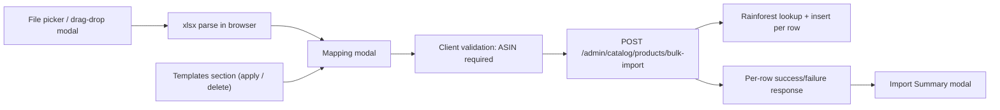

## Scope

- New UI flow on the admin Products page (`apps/admin-web/src/pages/ProductsPage.tsx`).
- New backend table + endpoints for shared (global) mapping templates.
- New bulk-import endpoint that wraps the existing single-product create path so per-row errors can be surfaced.
- Spreadsheet parsing happens in the browser using `xlsx` (SheetJS), keeping the API stateless.
- Mapping dropdown contains exactly: `Not Mapped`, `ASIN`, `VoiceX Name`, `VoiceX Description`, `VoiceX Price`, `Local Store Price`.
- Prices are interpreted as dollars (e.g. `12.99`, `$12.99`) and converted to cents server-side.

## Architecture



## Database

New migration applied via Supabase MCP (per `.cursor/rules/supabase-migrations.mdc`):

- `catalog_import_templates`
  - `id uuid pk default gen_random_uuid()`
  - `name text not null` (unique, case-insensitive)
  - `description text null`
  - `mapping jsonb not null` — array of `{ column_index: int, column_label: string, field: 'asin'|'voice_name'|'voice_description'|'custom_price'|'local_price' }`
  - `created_by uuid null references admin_users(id) on delete set null`
  - `created_at timestamptz default now()`, `updated_at timestamptz default now()`

Templates are global (visible to all admins), per the user's choice.

## Backend (`apps/api/src/modules/admin/catalog.ts`)

Add four routes inside `catalogRouter`:

- `GET /catalog/import-templates` — list all templates (id, name, description, mapping, created_at, created_by).
- `POST /catalog/import-templates` — body `{ name, description?, mapping }`; 409 on duplicate name (case-insensitive); writes audit log entry `create_import_template`.
- `DELETE /catalog/import-templates/:id` — deletes; audit log `delete_import_template`.
- `POST /catalog/products/bulk-import`
  - body: `{ rows: Array<{ row_number: number, asin: string, voice_name?: string, voice_description?: string, custom_price_cents?: number|null, local_price_cents?: number|null }> }`
  - Reuses helpers already in this file: `activeCatalogProductExistsForAsin`, `fetchAmazonProduct`, `pickFeaturedImageUrl`, `downloadAndStoreFeaturedThumbnail`, voicex_id auto-generation.
  - Processes rows with concurrency = 4 (mirrors `BULK_LOOKUP_CONCURRENCY` on the client).
  - Validates ASIN format (`/^[A-Z0-9]{10}$/`), checks duplicates, fetches Amazon data via the existing Rainforest helper (`fetchAmazonProduct`), creates the product, then inserts category links if any (none for import in v1).
  - Per-row failures (invalid ASIN, duplicate, Rainforest 404 / `RainforestProductLookupError`, DB error) are caught and returned without aborting the batch.
  - Response shape:
    ```ts
    {
      success: true,
      summary: { total: number, succeeded: number, failed: number },
      results: Array<
        | { row_number: number, asin: string, status: 'created', product_id: string, voicex_id: string }
        | { row_number: number, asin: string, status: 'failed', error: string }
      >
    }
    ```
  - One audit log row `bulk_import_products` with summary counts.

## Frontend

### Dependency
- Add `xlsx` (SheetJS) to `apps/admin-web/package.json` for parsing `.xlsx` / `.xls` / `.csv` in the browser.

### New module: `apps/admin-web/src/lib/import-mapping.ts`
- Constants for mappable fields (label, value, dropdown order).
- `parseSpreadsheetFile(file: File): Promise<{ headers: string[], sample: string[][], rows: string[][] }>` — reads workbook with `xlsx.read`, takes the first sheet, treats row 1 as headers (falling back to "Column N" if blank), returns up to 2 sample data rows for preview plus all data rows.
- `parsePriceToCents(raw: string): number | null` — strips `$`, commas, whitespace; returns rounded cents.
- `buildBulkRowsFromMapping(rows, mapping)` — produces the bulk-import payload, validating ASIN normalization and price parsing.

### New file: `apps/admin-web/src/components/ImportProductsFlow.tsx`
A self-contained component owning all three modals. Mounted from `ProductsPage` as a sibling to the existing add-product UI:

1. **File picker modal**
   - Drag-and-drop area + "Browse" button.
   - Accepts `.xlsx`, `.xls`, `.csv` only — both `accept` attribute and a runtime extension/MIME check; rejection error inline.
2. **Mapping modal** (opens automatically once a valid file is parsed)
   - "Change file" button at top — re-opens picker modal preserving nothing.
   - Templates section: lists rows from `GET /catalog/import-templates`. Each row has the template name, description, "Apply Now" button, and a trash icon. Apply maps `mapping[].column_label` (preferred) → falls back to `column_index` to set the dropdown for matching columns. Delete asks for confirm then `DELETE …/:id`.
   - Per-column rows: header cell = first-row value (or `Column N` if blank), then 1–2 sample data values, then a `<select>` listing `Not Mapped` + the 5 fields. A field already chosen elsewhere is rendered as `disabled` (grayed out). Selecting `Not Mapped` re-enables the option for other rows.
   - Bottom buttons:
     - **Import Products** — validates that ASIN is mapped (error toast if not), builds payload via `buildBulkRowsFromMapping`, POSTs to `/catalog/products/bulk-import`. Disables button while running.
     - **Save Template** — opens nested modal asking for name (required) + description (optional). Save calls `POST /catalog/import-templates`, then closes the nested modal and stays in mapping modal. Cancel just closes the nested modal.
     - **Cancel** — closes the whole flow and returns to products page.
3. **Import Summary modal**
   - Replaces the mapping modal once the import completes.
   - Shows totals: `X rows imported`, `Y succeeded` (green), `Z failed` (red).
   - If any failures, lists row number + reason for each failure.
   - Single **Close** button — closes the modal and triggers `refreshAfterMutation()` on the parent so the new products appear.

### Wiring in `ProductsPage.tsx`
- Add `Upload` icon import from `lucide-react` and an `Import` button next to the existing `Add Product` button (the block around lines 798–833).
- Add state `const [showImport, setShowImport] = useState(false)` and render `<ImportProductsFlow open={showImport} onClose={() => setShowImport(false)} onImported={refreshAfterMutation} />`.

## File-by-file changes

- [apps/admin-web/package.json](apps/admin-web/package.json) — add `xlsx` dependency.
- [apps/admin-web/src/pages/ProductsPage.tsx](apps/admin-web/src/pages/ProductsPage.tsx) — add Import button + render `ImportProductsFlow`.
- `apps/admin-web/src/components/ImportProductsFlow.tsx` (new) — modals, drag/drop, mapping UI, summary.
- `apps/admin-web/src/lib/import-mapping.ts` (new) — parsing + price helpers + field constants.
- [apps/api/src/modules/admin/catalog.ts](apps/api/src/modules/admin/catalog.ts) — add `import-templates` CRUD routes and `bulk-import` route.
- New Supabase migration (applied via Supabase MCP) creating `catalog_import_templates`.

## Out of scope (v1)
- Categories cannot be assigned via import (mapping fields are limited to the 5 the user specified).
- No background job / progress bar — the import is a single synchronous request; for hundreds of rows the modal shows a spinner until the response arrives.
- No update-existing semantics: an ASIN that already exists in the active catalog is reported as a failed row with the existing duplicate-ASIN error message.