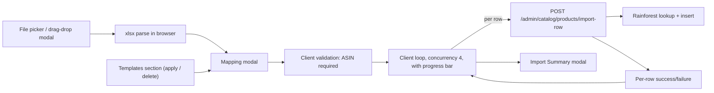

## Scope

- New UI flow on the admin Products page (`apps/admin-web/src/pages/ProductsPage.tsx`).
- New backend table + endpoints for shared (global) mapping templates.
- New bulk-import endpoint that wraps the existing single-product create path so per-row errors can be surfaced.
- Spreadsheet parsing happens in the browser using `xlsx` (SheetJS), keeping the API stateless.
- Mapping dropdown contains exactly: `Not Mapped`, `ASIN`, `VoiceX Name`, `VoiceX Description`, `VoiceX Price`, `Local Store Price`, `Category`.
- A `Category` cell may contain one or more category names separated by commas; each is matched (trimmed, case-insensitive) against existing `catalog_categories`. If any name does not exist, that row is rejected with the failing name in the error message.
- Prices are interpreted as dollars (e.g. `12.99`, `$12.99`) and converted to cents server-side.
- Per-row progress bar in the mapping modal driven by the client looping rows through a new per-row import endpoint with bounded concurrency.

## Architecture



## Database

New migration applied via Supabase MCP (per `.cursor/rules/supabase-migrations.mdc`):

- `catalog_import_templates`
  - `id uuid pk default gen_random_uuid()`
  - `name text not null` (unique, case-insensitive)
  - `description text null`
  - `mapping jsonb not null` — array of `{ column_index: int, column_label: string, field: 'asin'|'voice_name'|'voice_description'|'custom_price'|'local_price'|'category' }`
  - `created_by uuid null references admin_users(id) on delete set null`
  - `created_at timestamptz default now()`, `updated_at timestamptz default now()`

Templates are global (visible to all admins), per the user's choice.

## Backend (`apps/api/src/modules/admin/catalog.ts`)

Add four routes inside `catalogRouter`:

- `GET /catalog/import-templates` — list all templates (id, name, description, mapping, created_at, created_by).
- `POST /catalog/import-templates` — body `{ name, description?, mapping }`; 409 on duplicate name (case-insensitive); writes audit log entry `create_import_template`.
- `DELETE /catalog/import-templates/:id` — deletes; audit log `delete_import_template`.
- `POST /catalog/products/import-row`
  - body: `{ row_number: number, asin: string, voice_name?: string|null, voice_description?: string|null, custom_price_cents?: number|null, local_price_cents?: number|null, category_ids?: string[] }`
  - Reuses helpers already in this file: `activeCatalogProductExistsForAsin`, `fetchAmazonProduct`, `pickFeaturedImageUrl`, `downloadAndStoreFeaturedThumbnail`, voicex_id auto-generation, and the existing category-link insert pattern from `POST /catalog/products`.
  - Validates ASIN format (`/^[A-Z0-9]{10}$/`); on failure returns `200` with `{ success: false, status: 'failed', row_number, asin, error }` so the client can keep iterating.
  - Always returns HTTP `200`. Body shape:
    ```ts
    | { success: true,  status: 'created', row_number: number, asin: string, product_id: string, voicex_id: string }
    | { success: false, status: 'failed',  row_number: number, asin: string, error: string }
    ```
  - One audit log row per successful create (`create_product`, same as today). No batch-level audit row — the per-row entries already cover it.
  - Failure cases captured uniformly: invalid/missing ASIN, duplicate ASIN, Rainforest 404 / `RainforestProductLookupError`, DB error.
  - Note: client is responsible for resolving `Category` cell text → `category_ids` (it already has the full category list loaded). If the client can't resolve a name it short-circuits the row locally and never calls the server for it.

## Frontend

### Dependency
- Add `xlsx` (SheetJS) to `apps/admin-web/package.json` for parsing `.xlsx` / `.xls` / `.csv` in the browser.

### New module: `apps/admin-web/src/lib/import-mapping.ts`
- Constants for mappable fields (label, value, dropdown order) including new `category` field.
- `parseSpreadsheetFile(file: File): Promise<{ headers: string[], sample: string[][], rows: string[][] }>` — reads workbook with `xlsx.read`, takes the first sheet, treats row 1 as headers (falling back to "Column N" if blank), returns up to 2 sample data rows for preview plus all data rows.
- `parsePriceToCents(raw: string): number | null` — strips `$`, commas, whitespace; returns rounded cents.
- `parseCategoryCell(raw: string): string[]` — splits on commas, trims, drops empties.
- `resolveCategoryNames(names: string[], categories: {id: string, name: string}[]): { ids: string[]; missing: string[] }` — case-insensitive trimmed match; returns resolved IDs and any unmatched names.
- `buildImportRowFromMapping(spreadsheetRow, mapping, categories)` — produces a single `{ payload, error? }` for the per-row endpoint, validating ASIN normalization, price parsing, and category resolution (error short-circuits with the missing category name).

### New file: `apps/admin-web/src/components/ImportProductsFlow.tsx`
A self-contained component owning all three modals. Mounted from `ProductsPage` as a sibling to the existing add-product UI:

1. **File picker modal**
   - Drag-and-drop area + "Browse" button.
   - Accepts `.xlsx`, `.xls`, `.csv` only — both `accept` attribute and a runtime extension/MIME check; rejection error inline.
2. **Mapping modal** (opens automatically once a valid file is parsed)
   - "Change file" button at top — re-opens picker modal preserving nothing.
   - Templates section: lists rows from `GET /catalog/import-templates`. Each row has the template name, description, "Apply Now" button, and a trash icon. Apply maps `mapping[].column_label` (preferred) → falls back to `column_index` to set the dropdown for matching columns. Delete asks for confirm then `DELETE …/:id`.
   - Per-column rows: header cell = first-row value (or `Column N` if blank), then 1–2 sample data values, then a `<select>` listing `Not Mapped` + the 6 fields (`ASIN`, `VoiceX Name`, `VoiceX Description`, `VoiceX Price`, `Local Store Price`, `Category`). A field already chosen elsewhere is rendered as `disabled` (grayed out). Selecting `Not Mapped` re-enables the option for other rows.
   - Bottom buttons:
     - **Import Products** — validates that ASIN is mapped (error toast if not). Then enters an import phase that:
       - Disables the dropdowns and footer buttons.
       - Renders a progress bar + counter (`X / N completed · Y succeeded · Z failed`).
       - Iterates rows with concurrency 4, calling `POST /catalog/products/import-row` for each. Rows that fail client-side validation (missing ASIN, bad price, unknown category) are recorded as failures without an HTTP call.
       - Updates progress state after each row resolves.
       - When all rows are done, opens the Import Summary modal.
     - **Save Template** — opens nested modal asking for name (required) + description (optional). Save calls `POST /catalog/import-templates`, then closes the nested modal and stays in mapping modal. Cancel just closes the nested modal.
     - **Cancel** — closes the whole flow and returns to products page. While an import is running, Cancel becomes "Stop Import": it sets a cancel flag the loop checks before issuing the next row; in-flight rows finish, the summary modal then opens with the partial results.
3. **Import Summary modal**
   - Replaces the mapping modal once the import completes.
   - Shows totals: `X rows imported`, `Y succeeded` (green), `Z failed` (red).
   - If any failures, lists row number + reason for each failure.
   - Single **Close** button — closes the modal and triggers `refreshAfterMutation()` on the parent so the new products appear.

### Wiring in `ProductsPage.tsx`
- Add `Upload` icon import from `lucide-react` and an `Import` button next to the existing `Add Product` button (the block around lines 798–833).
- Add state `const [showImport, setShowImport] = useState(false)` and render `<ImportProductsFlow open={showImport} onClose={() => setShowImport(false)} onImported={refreshAfterMutation} />`.

## File-by-file changes

- [apps/admin-web/package.json](apps/admin-web/package.json) — add `xlsx` dependency.
- [apps/admin-web/src/pages/ProductsPage.tsx](apps/admin-web/src/pages/ProductsPage.tsx) — add Import button + render `ImportProductsFlow`.
- `apps/admin-web/src/components/ImportProductsFlow.tsx` (new) — modals, drag/drop, mapping UI, summary.
- `apps/admin-web/src/lib/import-mapping.ts` (new) — parsing + price helpers + field constants.
- [apps/api/src/modules/admin/catalog.ts](apps/api/src/modules/admin/catalog.ts) — add `import-templates` CRUD routes and `import-row` route.
- New Supabase migration (applied via Supabase MCP) creating `catalog_import_templates`.

## Out of scope (v1)
- No update-existing semantics: an ASIN that already exists in the active catalog is reported as a failed row with the existing duplicate-ASIN error message.
- No "create category on the fly" from the import — admins must add unknown categories from the existing categories page first; otherwise rows referencing them are rejected per spec.