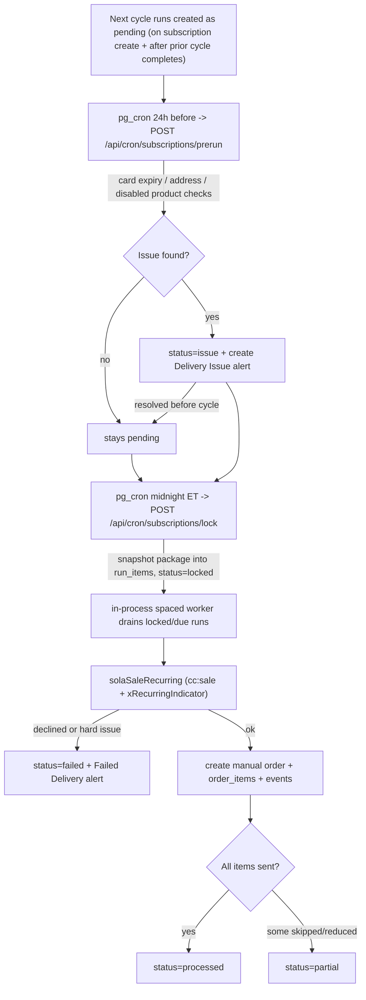

# VoiceX Subscriptions Feature

## Architecture decisions (from your answers)

- Fulfillment is **Manual only**. The processing engine charges the card then creates a `fulfillment_provider='manual'` order (same shape as the manual branch in [checkout-handlers.ts](apps/api/src/modules/ivr/handlers/checkout-handlers.ts) lines 2159-2198). All Amazon/Rye calls are left out, but the "charge then fulfill" step is isolated behind a single function so the Amazon Partner API can slot in later with no refactor.
- Scheduling is **Supabase `pg_cron` + `pg_net`** calling protected API cron endpoints; the always-on Express server runs the **time-spaced worker in-process**.
- Schema changes go through the **Supabase MCP** `apply_migration` (per [.cursor/rules/supabase-migrations.mdc](.cursor/rules/supabase-migrations.mdc)), with matching SQL files kept in `supabase/migrations/` for repo history.
- IVR follows the **Returns template**: handler-driven nodes embed the next `node_key` directly (not `resolveNextNode`); menu nodes use `config.intents`. Template files: [returns-handlers.ts](apps/api/src/modules/ivr/handlers/returns-handlers.ts), [returns.ts](apps/api/src/lib/returns.ts), [seed_returns_ivr_nodes.sql](supabase/migrations/20260603171038_seed_returns_ivr_nodes.sql), [admin/returns.ts](apps/api/src/modules/admin/returns.ts), [ReturnsPage.tsx](apps/admin-web/src/pages/ReturnsPage.tsx).
- Processing dates per week: Week 1 -> 1st, Week 2 -> 8th, Week 3 -> 15th, Week 4 -> 22nd, at 12:00 AM `America/New_York`. The history feed reuses the append-only pattern of `order_events` / `admin_audit_logs`.

## Data model (new tables + extensions)

- `subscriptions` - one per user: `user_id` (unique), `subscription_address_id`, `payment_method_id`, `terms_explanation_count` (int), `terms_accepted_at`. Tracks the per-user "heard explanation 2x / accepted terms" state.
- `subscription_deliveries` - up to 4 per subscription: `week_number` (1-4), base `status` (`active`/`temp_paused`/`perm_paused`), `pause_type`, `paused_cycles`, `pause_resume_date`, `paused_at`, `next_cycle_date`. The admin "Failed" state is derived from the latest run, not stored on the delivery.
- `subscription_delivery_items` - the live Package: `delivery_id`, `product_id`, `quantity`, unique `(delivery_id, product_id)`.
- `subscription_delivery_runs` - one queue row per delivery per cycle date: `cycle_date`, `status` (`pending`/`issue`/`locked`/`processing`/`processed`/`partial`/`failed`/`skipped`), `scheduled_at`, `processed_at`, `order_id`, `sola_ref_num`, `sola_transaction_id`, `issue_details` jsonb, `failure_details` jsonb, `attempt_count`, `idempotency_key` (unique, = user+week+cycle+attempt), unique `(delivery_id, cycle_date)`.
- `subscription_delivery_run_items` - **immutable snapshot** copied at lock time: `run_id`, `product_id`, `voicex_id`, `product_name`, `quantity`, `original_quantity`, `unit_price_cents`, `amazon_price_cents`, `status` (`included`/`reduced`/`skipped_unavailable`/`skipped_disabled`), `reason`.
- `subscription_events` - append-only history feed: `subscription_id`, `delivery_id`, `run_id`, `event_type`, `actor_type` (`admin`/`hotline`/`system`), `actor_admin_id`, `details` jsonb.
- Extend `admin_alerts`: add nullable `user_id` (FK users) and `heard_at` (the user "tag", distinct from admin `status`); subscription alerts use `entity_type='subscription_delivery'`, `entity_id=delivery_id` (avoids the existing `user`/`catalog_product` unique indexes so multiple per delivery are allowed), with week/run/issue type + `ivr_message` in `payload`.
- Extend `orders`: add nullable `subscription_delivery_run_id` and `subscription_week_number` (null => Type "Cart", else "Week N") for the Orders Type column/filter.
- New shared constants in [packages/shared/src/types/alerts.ts](packages/shared/src/types/alerts.ts): `subscription_delivery_issue`, `subscription_failed_delivery`.

## Run lifecycle

## Staged implementation

Stages are ordered to lock down the money-handling core before the large IVR/admin surface. Each stage is independently testable.

1. Data model + shared types (migrations via Supabase MCP).
2. Recurring charge helper in [sola.ts](apps/api/src/lib/sola.ts) (`cc:sale` + `xRecurringIndicator: 'Recurring'`), leaving existing auth/capture untouched.
3. Processing engine: lock/snapshot, 24h pre-run check, in-process spaced worker, isolated manual-order creation, alert creation, idempotency.
4. Scheduler wiring: protected `/api/cron/subscriptions/*` endpoints + `pg_cron`/`pg_net` jobs (DST-safe, idempotent).
5. IVR core: main-menu option 5, seed migration, `subscriptions-handlers.ts` + `lib/subscriptions.ts` for add/hear/edit/transfer/remove/clear package flows.
6. IVR pause/address/card/explanation: pause+reactivate (single + all), set address/card (reuse existing checkout chains), explanation auto-play + per-user terms tracking.
7. IVR alerts inbox: post-PIN announce node, read-with-call-to-action, jump-to-fix + retry/skip, `heard_at` tagging.
8. Admin Subscriptions Management page (card rows, 4 mini-cards, edit-package / checkout / history / alerts popups) + backend.
9. Admin Subscription Queue (tab) with status filters, retry/skip, partial/failed detail popups + backend.
10. Admin Alerts: Delivery Issues + Failed Deliveries tabs, user/type/status/heard/date filters, manual-add, heard tag.
11. Admin reports (4) + cross-page integrations: Orders Type column/filter, Dashboard cards, Users Subscription column/popup, Products Subscriptions section.

## Key integration points

- IVR entry rewire: add `alerts_announce` between `validate_pin` success and `main_menu` in [pin-handlers.ts](apps/api/src/modules/ivr/handlers/pin-handlers.ts) (lines 91-100), mirrored in [registration-handlers.ts](apps/api/src/modules/ivr/handlers/registration-handlers.ts).
- Handler registration: new files imported in [init-handlers.ts](apps/api/src/modules/ivr/init-handlers.ts).
- Admin app: route in [App.tsx](apps/admin-web/src/App.tsx), nav after Orders in [Layout.tsx](apps/admin-web/src/components/Layout.tsx) `NAV_ITEMS`, API mounts in [admin/routes.ts](apps/api/src/modules/admin/routes.ts), client calls via [lib/api.ts](apps/admin-web/src/lib/api.ts).
- Worker + cron routes registered in [server.ts](apps/api/src/server.ts).

## Notes / deferrals

- "Current Amazon price" in admin edit popup and "Amazon Total / Profit" in reports use the stored `amazon_price_cents`; Amazon Order IDs are admin-entered during manual fulfillment until the Partner API lands.
- Stock/qty availability pre-checks (24h) are best-effort while Manual (no live Amazon stock); card-expiry, missing address/card, and disabled-product checks are authoritative.
- DST: `pg_cron` runs in UTC; cron endpoints re-derive the authoritative `America/New_York` cycle date and are fully idempotent (safe if fired more than once).
